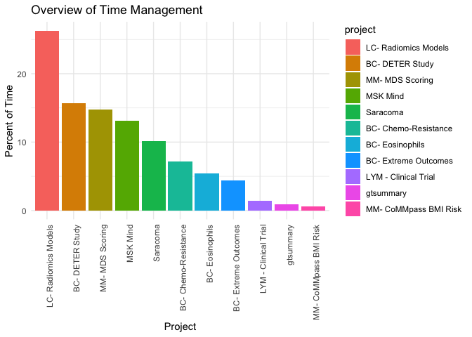

<!-- README.md is generated from README.Rmd. Please edit that file -->
togglvis
========

<!-- badges: start -->
<!-- badges: end -->
Installation
------------

You can install the released version of togglvis from [CRAN](https://CRAN.R-project.org) with:

``` r
install.packages("remotes")
remotes::install_github("karissawhiting/togglvis")
```

Example
-------

This is a basic example showing how to get data from the togglr API and process and visualize it.

``` r
library(togglvis)
library(dplyr)
#> 
#> Attaching package: 'dplyr'
#> The following objects are masked from 'package:stats':
#> 
#>     filter, lag
#> The following objects are masked from 'package:base':
#> 
#>     intersect, setdiff, setequal, union
## basic example code
```

Get summary report data using togglr app, or download data from web browser

``` r
# See togglr documentation for how to set up the API key
report <- togglr::get_detailled_report()
```

``` r
processed_report <- process_report(report)
time_bar_chart(processed_report)
```


